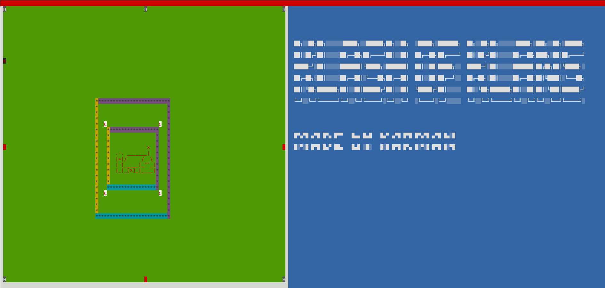
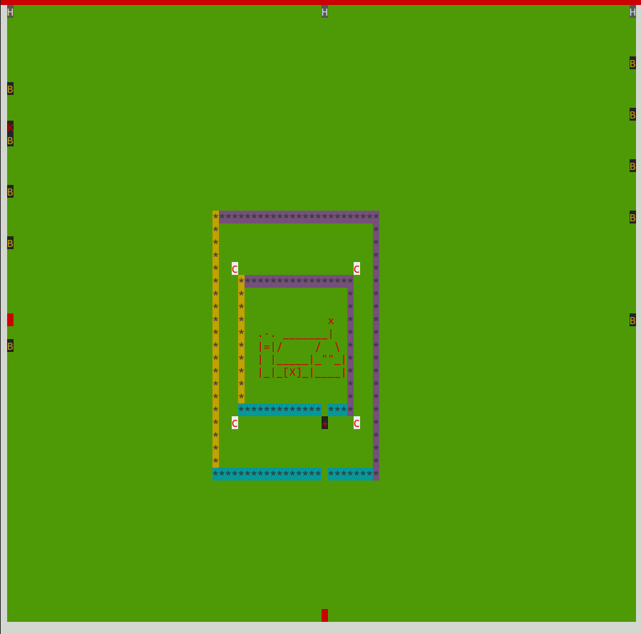
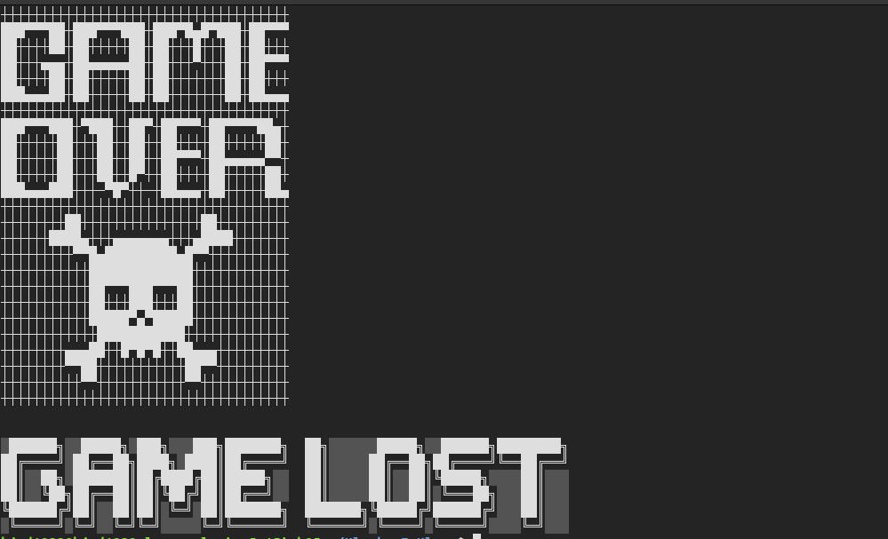

# Klash Of Klans 

██╗░░██╗██╗░░░░░░█████╗░░██████╗██╗░░██╗  ░█████╗░███████╗  ██╗░░██╗██╗░░░░░░█████╗░███╗░░██╗░██████╗
██║░██╔╝██║░░░░░██╔══██╗██╔════╝██║░░██║  ██╔══██╗██╔════╝  ██║░██╔╝██║░░░░░██╔══██╗████╗░██║██╔════╝
█████═╝░██║░░░░░███████║╚█████╗░███████║  ██║░░██║█████╗░░  █████═╝░██║░░░░░███████║██╔██╗██║╚█████╗░
██╔═██╗░██║░░░░░██╔══██║░╚═══██╗██╔══██║  ██║░░██║██╔══╝░░  ██╔═██╗░██║░░░░░██╔══██║██║╚████║░╚═══██╗
██║░╚██╗███████╗██║░░██║██████╔╝██║░░██║  ╚█████╔╝██║░░░░░  ██║░╚██╗███████╗██║░░██║██║░╚███║██████╔╝
╚═╝░░╚═╝╚══════╝╚═╝░░╚═╝╚═════╝░╚═╝░░╚═╝  ░╚════╝░╚═╝░░░░░  ╚═╝░░╚═╝╚══════╝╚═╝░░╚═╝╚═╝░░╚══╝╚═════╝░

█▀▄▀█ ▄▀█ █▀▄ █▀▀   █▄▄ █▄█   █▄▀ ▄▀█ █▀█ █▀▄▀█ ▄▀█ █▄░█
█░▀░█ █▀█ █▄▀ ██▄   █▄█ ░█░   █░█ █▀█ █▀▄ █░▀░█ █▀█ █░▀█

- A Terminal Based imitation of Clash of Clans 

## Features

1. King 
   1. Controls : 
      1. <KBD>W</KBD> - up movement
      2. <KBD>A</KBD> - left movement
      3. <KBD>S</KBD> - right movement
      4. <KBD>D</KBD> - down movement
      5. <KBD>SPACE</KBD> - attack
2. Barbarians 
   1. Automated troops that can be spawn using the <KBD>Z</KBD> , <KBD>X</KBD> , <KBD>C</KBD> , that are generated from the 3 spawning points , and move, target the nearest buildings.
   2. A max camp size has been set to 20
3. Cannons
   1. Shoot and kill the nearest enemies
4. Spells 
   1. 2 spells of each type, heal and rage have been given for a game 
   2. for heal spell use <KBD>H</KBD> and for rage spell use <KBD>R</KBD>
5. Replay 
   1. Replay feature has been implemented 
6. Impressive UI and Design of the game!!

Enjoy !!!!!!

#### main game

#### troops on attack

#### game won

#### game lost
